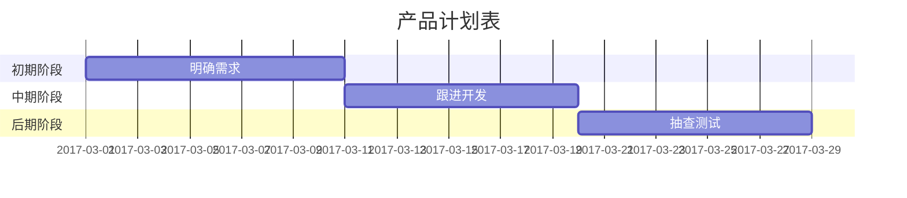

# Hello World!
# 一级标题
## 二级标题
### 三级标题

<!-- keywords:key1;key2; -->
<!-- description:this is a description -->
<!-- coverimage: -->

---

**重点加粗**

*斜体*

~~删除线~~

---

列表：

* 无序列表
    * 嵌套无序列表
    * 嵌套无序列表
*无序列表
*无序列表


1. 有序列表
   1. 嵌套有序列表1
   2. 嵌套有序列表2
2. 有序列表
3. 有序列表


---

引用文本：

> 引用别人说的话
> 就这样写
> By.OrangeX4

---

这是 '行内代码'语法.

代码块语法：

```  python
print("Hello,World!")
```

请将'替换成`.

---

==[百度]（www.baidu.com）==


<!--注释 -->

表格：

| 表头    | 表头    |
| - | -| 
| content | content |
|^     | content |

---

```sequence
participant 客户端 as A
participant 服务端 as B
participant 通行证中心 as C
Note over A:用户输入通行证账号、密码
A->C: 发送账号、密码
Note over C:验证账号、密码
C-->>A:返回token
A->B:发送token
B->C:验证token
C-->>B:验证成功
B-->>A:登陆成功
Note left of A:左边注释
B->B:自交互
Note right of C:右边注释
```
---
```flow
st=>start: 开始
io=>inputoutput: 验证
op=>operation: 选项
cond=>condition: 是 或 否？
sub=>subroutine: 子程序
e=>end: 结束

st->io->op->cond
cond(yes)->e
cond(no)->sub->io
```

---


---
近期任务安排:
- [x] 整理Markdown手册
- [ ] 改善项目
  - [x] 优化首页显示方式
  - [x] 修复闪退问题
  - [ ] 修复视频卡顿
- [ ] A3项目修复
   - [x] 修复数值错误


<div class="footer">
   © 2004 Foo Corporation
</div>


<table>
    <tr>
        <th rowspan="2">值班人员</th>
        <th>星期一</th>
        <th>星期二</th>
        <th>星期三</th>
    </tr>
    <tr>
        <td>李强</td>
        <td>张明</td>
        <td>王平</td>
    </tr>
</table>


# Markdown箭头的输入方法汇总

## 普通箭头

箭头形状 | MarkDown
 :-: | - 
$\uparrow$ | \$\uparrow$
$\Uparrow$ | \$\Uparrow$
$\downarrow$ | \$\downarrow$
$\Downarrow$ | \$\Downarrow$
$\leftarrow$ | \$\leftarrow$
$\Leftarrow$ | \$\Leftarrow$
$\rightarrow$ | \$\rightarrow$
$\Rightarrow$ | \$\Rightarrow$
$\updownarrow$ | \$\updownarrow$
$\Updownarrow$ | \$\Updownarrow$
$\leftrightarrow$ | \$\leftrightarrow$
$\Leftrightarrow$ | \$\Leftrightarrow$
---
## 长箭头

箭头形状 | MarkDown
 :-: | - 
$\longleftarrow$ | \$\longleftarrow$
$\Longleftarrow$| \$\Longleftarrow$
$\longrightarrow$ | \$\longrightarrow$
$\Longrightarrow$ | \$\Longrightarrow$
$\longleftrightarrow$ | \$\longleftrightarrow$
$\Longleftrightarrow$ | \$\Longleftrightarrow$
---
## 其他箭头

箭头形状 | MarkDown
 :-: | - 
$\twoheadrightarrow$ | \$\twoheadrightarrow$
$\rightarrowtail$ | \$\rightarrowtail$
$\looparrowright$ | \$\looparrowright$
$\curvearrowright$ | \$\curvearrowright$
$\circlearrowright$ | \$\circlearrowright$
$\Rsh$ | \$\Rsh$
$\multimap$ | \$\multimap$
$\leftrightsquigarrow$ | \$\leftrightsquigarrow$
$\rightsquigarrow$ | \$\rightsquigarrow$
$\leadsto$ | \$\leadsto$
$\nearrow$ | \$\nearrow$
$\searrow$ | \$\searrow$
$\swarrow$ | \$\swarrow$
$\nwarrow$ | \$\nwarrow$
$\nleftarrow$ | \$\nleftarrow$
$\nLeftarrow$ | \$\nLeftarrow$
$\nrightarrow$ | \$\nrightarrow$
$\nRightarrow$ | \$\nRightarrow$
$\nleftrightarrow$ | \$\nleftrightarrow$
$\nLeftrightarrow$ | \$\nLeftrightarrow$
$\dashrightarrow$ | \$\dashrightarrow$
$\dashleftarrow$ | \$\dashleftarrow$
$\leftleftarrows$ | \$\leftleftarrows$
$\leftrightarrows$ | \$\leftrightarrows$
$\Lleftarrow$ | \$\Lleftarrow$
$\twoheadleftarrow$ | \$\twoheadleftarrow$
$\leftarrowtail$ | \$\leftarrowtail$
$\looparrowleft$ | \$\looparrowleft$
$\curvearrowleft$ | \$\curvearrowleft$
---
箭头形状 | MarkDown
 :-: | - 
$\circlearrowleft$ | \$\circlearrowleft$
$\Lsh$ | \$\Lsh$
$\mapsto$ | \$\mapsto$
$\hookleftarrow$ | \$\hookleftarrow$
$\hookrightarrow$ | \$\hookrightarrow$
$\upharpoonright$ | \$\upharpoonright$
$\upharpoonleft$ | \$\upharpoonleft$
$\downharpoonright$ | \$\downharpoonright$
$\downharpoonleft$ | \$\downharpoonleft$
$\leftharpoonup$ | \$\leftharpoonup$
$\rightharpoonup$ | \$\rightharpoonup$
$\rightharpoondown$ | \$\rightharpoondown$
$\leftharpoondown$ | \$\leftharpoondown$
$\upuparrows$ | \$\upuparrows$
$\downdownarrows$ | \$\downdownarrows$
$\rightrightarrows$ | \$\rightrightarrows$
$\rightleftarrows$ | \$\rightleftarrows$
$\leftleftarrows$ | \$\leftleftarrows$
$\leftrightarrows$ | \$\leftrightarrows$
$\rightleftharpoons$ | \$\rightleftharpoons$
$\leftrightharpoons$ | \$\leftrightharpoons$


$$
\begin{cases}
x=\rho\cos\theta \\
y=\rho\sin\theta \\
\end{cases}  \\
x^2+y^2=1  \\
x^2+y^{12}=1 \\
x_1+y_{12}=1 \\
\text{} \\
\frac{1}{2} \\
\displaystyle\frac{x+1}{x-1} \\
$$

$$\sqrt{2}$$
$\sqrt[n]{2}$


$a\!b$
$ab$
$a\,b$
$a\;b$
$a\ b$
$a\quad b$
$a\qquad b$
$\sum_{k=1}^n\frac{1}{k} \quad \displaystyle\sum_{k=1}^n\frac{1}{k}$
$\prod_{k=1}^n\frac{1}{k} \quad \displaystyle\prod_{k=1}^n\frac{1}{k}$
$\displaystyle \int_{0}^1x{\rm d}x \quad \iint_{D_{xy}} \quad \iiint_{\Omega_{xyz}}$


$\frac{1+2}{}$
$\\\alpha_1,\alpha_2,\cdots,\alpha_n$

$\\\sum_{n=1}^{\infty} a_n z^n$

$$
    \begin{cases}
        k_{11}x_1+k_{12}x_2+\cdots+k_{1n}x_n=b_1 \\
        k_{21}x_1+k_{22}x_2+\cdots+k_{2n}x_n=b_2 \\
        \cdots \\
        k_{n1}x_1+k_{n2}x_2+\cdots+k_{nn}x_n=b_n \\
    \end{cases}
$$
<!-- 矩阵 -->

$$
    \begin{pmatrix}
    1 & 1 & \cdots & 1 \\   
    1 & 1 & \cdots & 1 \\
    \vdots & \vdots  & \ddots & \vdots \\
    1 & 1 & \cdots & 1 \\
    \end{pmatrix}
    \quad
    \begin{bmatrix}
    1 & 1 & \cdots & 1 \\   
    1 & 1 & \cdots & 1 \\
    \vdots & \vdots  & \ddots & \vdots \\
    1 & 1 & \cdots & 1 \\
    \end{bmatrix}    
$$
<!-- 行列式 -->
$$
    \begin{vmatrix}
    1 & 1 & \cdots & 1 \\   
    1 & 1 & \cdots & 1 \\
    \vdots & \vdots  & \ddots & \vdots \\
    1 & 1 & \cdots & 1 \\
    \end{vmatrix}  
$$

$$
    \cdot   \times  \otimes  \oplus \pm \circ \rightarrow  \xrightarrow[fgh]{abcde}  
$$
$$
    \alpha_1,
<!-- keywords:key1;key2; -->
<!-- description:this is a description -->
<!-- coverimage: -->

<!-- keywords:key1;key2; -->
<!-- description:this is a description -->
<!-- coverimage: -->
\alpha_2,\cdots,\alpha_n  \\
    \sqrt{-1}
$$

$$
    \displaystyle\prod_{n=1}^{\infty} 
    \\displaystyle
    
$$